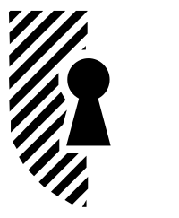
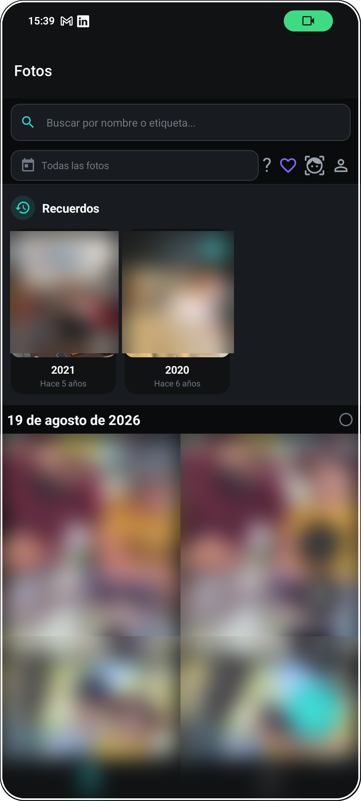
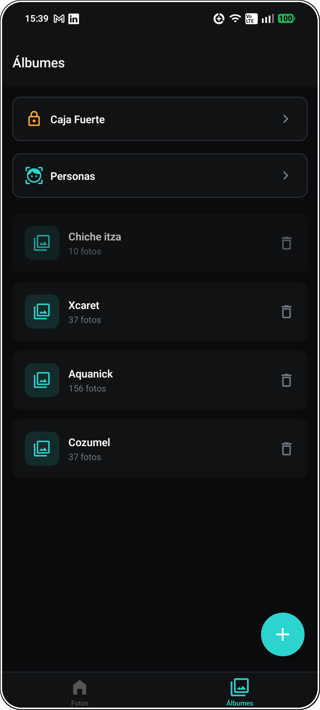
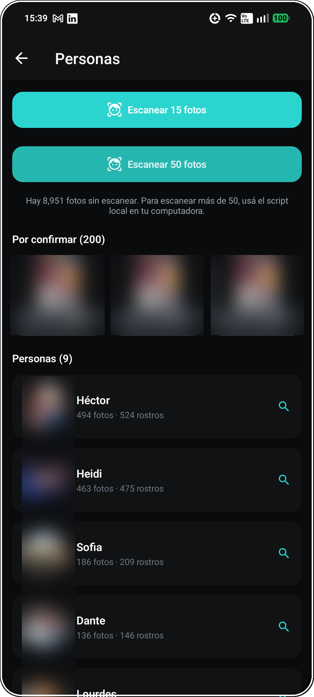

# Vaulta

App de fotos privadas para Android: tu propia nube de fotos, con búsqueda por rostro y sin depender de Google Fotos o iCloud.

<table align="center">
  <tr>
    <td align="center">
       
      <b>Fotos</b>
    </td>
    <td align="center">
       
      <b>Álbumes</b>
    </td>
    <td align="center">
       
      <b>Personas</b>
    </td>
  </tr>
</table>

## Por qué existe

Subir tus fotos a la nube de alguien más significa aceptar sus términos, su compresión, y que algún día decidan cambiar el plan gratuito. Vaulta es una app de fotos privada, autoalojada: tú controlas dónde viven tus fotos y quién puede verlas — incluyendo un álbum "Caja Fuerte" protegido con PIN/biometría para lo que de verdad quieres mantener aparte.

## Features

- 🖼️ Galería con scroll infinito, "Recuerdos" (fotos de este día en años anteriores) y favoritos
- 📁 Álbumes personalizados + **Caja Fuerte** protegida con PIN/biometría
- 👤 Reconocimiento facial — agrupa fotos por persona automáticamente
- 🔍 Detección de duplicados
- 📤 Exportar fotos/álbumes por email (ZIP)
- 🔄 Sincronización automática y subida en segundo plano
- 🌗 Modo oscuro/claro

## Stack

React Native · TypeScript · React Navigation

> API en NestJS + Cloudflare R2: **[vaulta_backend](https://github.com/Hector0122/vaulta_backend)**

## Licencia

MIT — ver [LICENSE](LICENSE)
